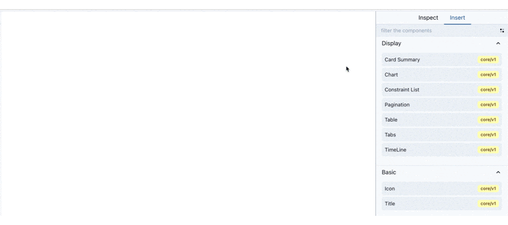
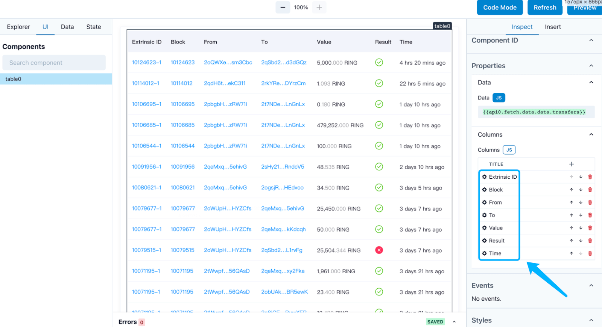
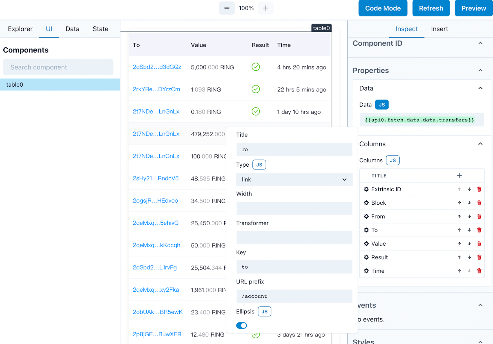

# Subscan Widget App

✨ Subscan Widget App is a platform to generate and configure data views by widgets. It has rich built-in widgets and support commonly used data sources, such as HTTP API, GraphQL, State, LocalStorage, etc.


## Show Case

Take the Table component as an example:

#### 1.Drag the Table component into the editing canvas

<p>
  
</p>

#### 2.Configure the Table in inspect tab

<p>
  
  
</p>

## Struct

```
src
 ┣ components  # react components
 ┣ config
 ┃ ┣ constants.ts
 ┃ ┗ runtime.ts  # editor default configured components libs
 ┣ editor  # editor interface
 ┃ ┣ LocalStorageManager.ts
 ┃ ┣ index.tsx
 ┃ ┗ services.ts # pro.subscan.io api
 ┣ hooks  # react hooks
 ┃ ┗ useStateValue.ts
 ┣ preview  # decoder interface
 ┣ widgets  # subscan widgets
 ┣ types
 ┣ ui   # theme, styled-components
 ┣ utils
```

## Installation

```
$ yarn add @subscan/widget-app
```

```javascript
import { Preview } from "@subscan/widget-app";
import '@subscan/widget-app/dist/main.css';

<Preview options={widgetJson} isDark={false} />
```

## Available Scripts

In the project directory, you can run:

### `yarn start:local`

Runs the app in the development mode.\
Open [http://localhost:3000](http://localhost:3000) to view it in the browser.

The page will reload if you make edits.\
You will also see any lint errors in the console.

### `yarn run build:local`

Builds the app for production to the `build` folder.\
It correctly bundles React in production mode and optimizes the build for the best performance.

The build is minified and the filenames include the hashes.\
Your app is ready to be deployed!

See the section about [deployment](https://facebook.github.io/create-react-app/docs/deployment) for more information.

## Develop
```bash
# some useful yarn script could help you develop faster

# create a component
yarn run add:component -- --version custom/v1 --name button
# create a trait
yarn run add:trait -- --version custom/v1 --name validation
# create a util method
yarn run add:utilMethod -- --version custom/v1 --name alert
```

### Subscan Components Storybook
```bash
# http://localhost:6006/
yarn storybook
```

### Widget Spec
| parameter name | type          | description                                                  |
| -------------- | ------------- | ------------------------------------------------------------ |
| version        | string        | The `version` of the same set of Components is usually the same. The format is "xxx/vx" , eg "`core/v1`". |
| kind           | `"Component"` | Fixed, indicating that this is a Component Spec. Calling implementRuntimeComponent does not require.            |
| metadata       |               | See below for details                                        |
| spec           |               | Array of Component Spe                                       |


### Component Spec

In Subscan Widget, it contains 2 basic concepts, a collection of functions is also a module exported by Editor, we call it `Widget`.
The content that can be dragged in the right column of the Editor, we call it a `Component`, Widget is composed of multiple Components.

| parameter name | type          | description                                                  |
| -------------- | ------------- | ------------------------------------------------------------ |
| version        | string        | The `version` of the same set of Components is usually the same. The format is "xxx/vx" , eg "`core/v1`". |
| kind           | `"Component"` | Fixed, indicating that this is a Component Spec. Calling implementRuntimeComponent does not require.            |
| metadata       |               | See below for details                                        |
| spec           |               | See below for details                                        |

#### Metadata of Component Spec

Metadata contains the meta information of the Component.

| parameter name    | type                 | remarks                                                      |
| ----------------- | -------------------- | ------------------------------------------------------------ |
| name              | string               | The name of the Component. The `version` and `name` of a Component together constitute the unique identifier of the Component. |
| description       | string?              |                                                              |
| displayName       | string?              | The name to display in the Component list in the Editor.     |
| exampleProperties | Record<string, any>  | The initial `properties` for the Component when it was created in the Editor. |
| annotations       | Record<string, any>? | Some fields can be custom declared.                          |

#### Spec of Component Spec

When defining `properties` and `state`, we use [JSONSchema](https://json-schema.org/). JSONSchema itself is JSON but can be used to declare the type of a JSON data structure. With type help, Widget Editor can checksum and autocomplete for parameters and expressions.

| parameter name | type                                    | remarks                                                      |
| -------------- | --------------------------------------- | ------------------------------------------------------------ |
| properties     | JSONSchema                              | Parameters accepted by Component.                            |
| state          | JSONSchema                              | State exposed by Component.                                  |
| methods        | Record<KMethodName, JSONSchema>         | Method exposed by Component. The key is the name of the Method, and the value is the parameter of the Method. |
| events         | string[]                                | Events that the Component will emit. The array element is the name of the Event. |
| slots          | Record<string, {slotProps: JSONSchema}> | Component reserved slots that can be inserted into child Component. |
| styleSlots     | string[]                                | Component Reserved slots for adding styles.                  |

### Component Implementation Parameters

The parameter of Component Implementation is essentially an object, but it is actually a combination of several components. It can be roughly divided into:

| Parameter Name  | Type                                                         | Remarks                                                    | Source   |
| --------------- | ------------------------------------------------------------ | ---------------------------------------------------------- | -------- |
| component       | ComponentSchema                                              | Component's Schema                                         | API      |
| app             | ApplicationSchema                                            | Schema of the entire Application                           | API      |
| slotsElements   | Record<string, (slotProps: any) => ReactElement[]>           | List of child Component                                    | API      |
| mergeState      | (partialState: object) => void                               | `mergeState` allows merging the internal state of the component into the global state. Get it through `{{componentsId.state_name}}` | API      |
| subscribeMethod | (methodsMap: Record<string, (params: object) => void>) => void | `subscribeMethods` is similar to `mergeState` to export methods to global. Components can trigger each other's internal methods through `{{componentId.method_name}}` | API      |
| elementRef      | React.Ref                                                    | elementRef and getElement are to register the DOM elements with Widget. Widget implements many functions through the component's ref, such as the ability to highlight Components in the editor. | API      |
| getElement      | (ele: HTMLElement) => void                                   | same as above                                              | API      |
| services        | object                                                       | Various service instances of Widget.                       | services |
| customStyle     | Record<string, string>                                       | Custom style from Trait                                    | Trait    |
| callbackMap     | Record<string, Function>                                     | Callback function from Trait                               | Trait    |

#### Services

Services are instances of Widget Editor's various services, including state management, event monitoring, component registration, and more. These Services are globally unique instances.

| parameter name | type | remarks |
| ---------------- | ------------------------ | ------------------------------------------------------------ |
| registry | Registry | All Widget Components, Traits, and Modules are registered on the Registry, where you can find their corresponding Spec and Implementation. |
| stateManager | StateManager | StateManager manages global state store and also has the function of eval expression(`stateManager.deepEval()`). |
| globalHandlerMap | GlobalHandlerMap | GlobalHandlerMap manages all Component Method instances. |
| apiService | ApiService | ApiService is the global event bus. |
| eleMap | Map<string, HTMLElement> | eleMap stores all Component's DOM elements. |


## Links

Dev: https://subscan-pro-staging.vercel.app/lowcode

## Learn More

[Widget Editor](https://github.com/subscan-explorer/widget-editor).

[Create React App documentation](https://facebook.github.io/create-react-app/docs/getting-started).

[React documentation](https://reactjs.org/).
