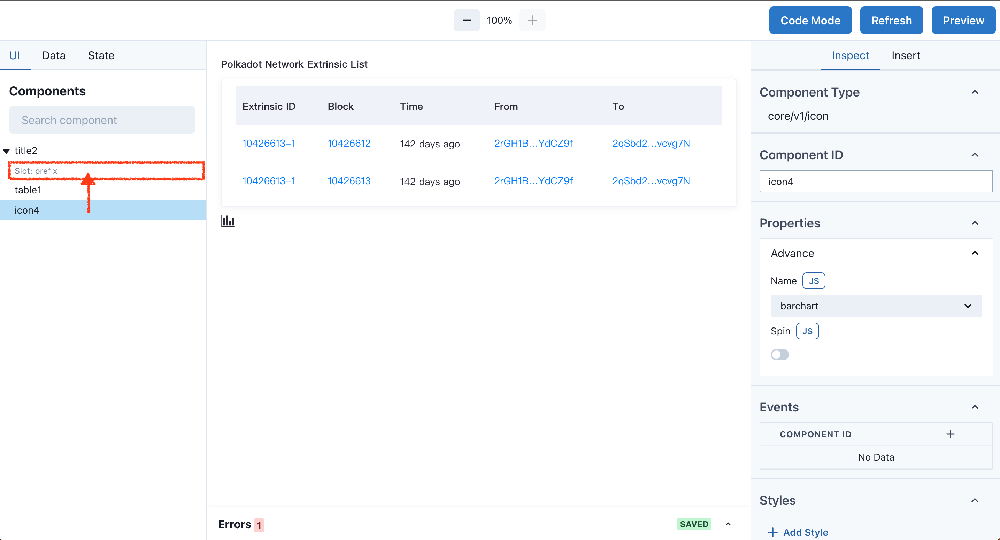
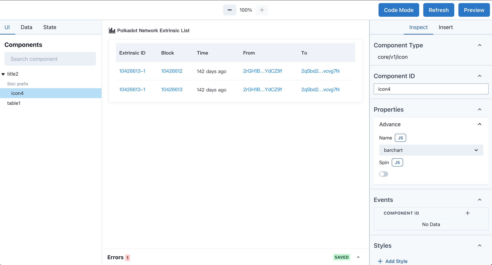

# Icon component

Use the Icon component to display an icon

---

Icon is used to display Logo, often used in combination with other components

## Standalone icon

Drag and drop the Icon into the Canvas, the default Icon is a standalone component, switch the icon by changing the Name value, turn on the Spin switch, the icon rotates clockwise.

Property description:

| Column Key | Description | Example |
| ----------- | ----------- | ----------- |
| Name | Icon name, used to switch different icons | `barchart` `finalized` `note` `person` ... |
| Spin | Rotation animation | `true` `false` |

## Use with Title component

The Title component in the UI Tab is displayed differently from other components, with a drop-down triangle arrow and `Slot:prefix` sub-item, because Title can use other components as its sub-components (more documentation can be found in the Slot independent section), drag and drop `icon4` into `Slot:prefix` to use Icon as a sub-component of Title.

Effect:

