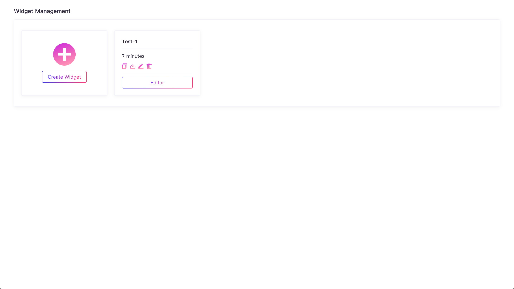

# Widget Interface

学习使用 Subscan Widget 编辑器。

---

Widget Interface 用于构建 Widget apps, 分为2个主要的页面：

- Widget 管理 - 管理已经创建的 Widget
- Widget 编辑器 - 构建 Widget 的工厂，包含画板、组件栏、API栏

> `yarn start:local` 本地模式运行 APP
在浏览器访问 <http://localhost:3000>
