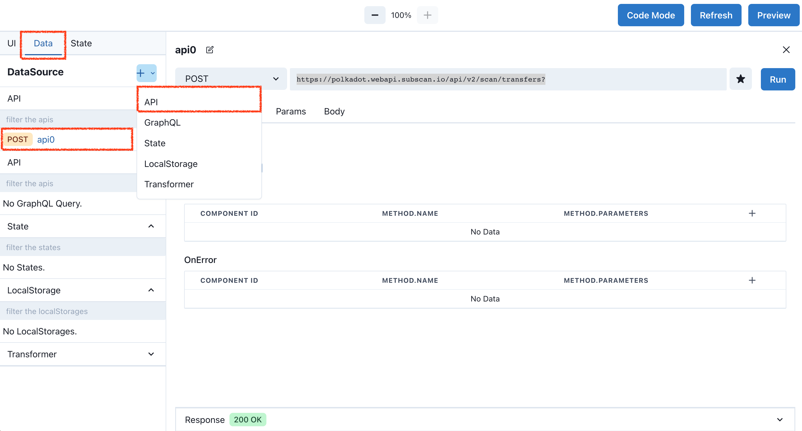
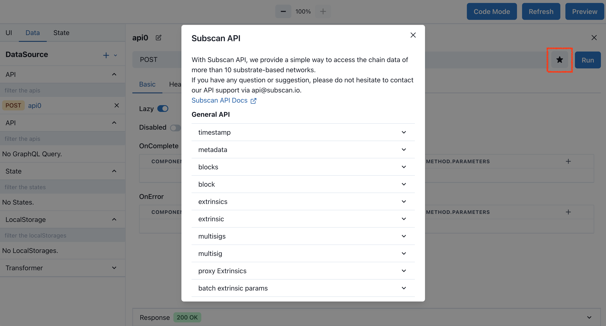
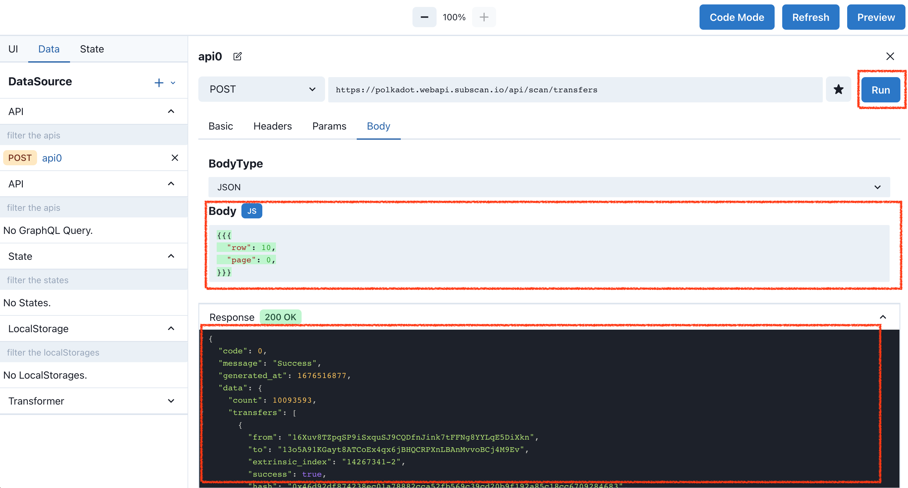
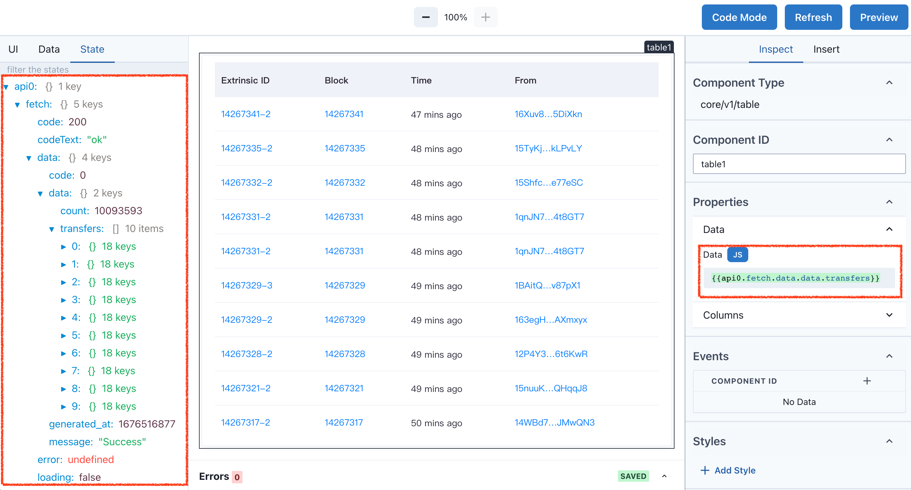

# 数据源 - API 组件

一个可视化的 HTTP 客户端，轻松获取服务器数据。

---

## 从 Subscan API 获取 Polkadot Network 最新的转账数据

数据源 - API 组件可以在左侧面板 `Data` 中找到它，点击 + 号，选中 `API`，Editor 为我们建立一个名称为 `api0` 的 API。

>[https://www.w3schools.com/tags/ref_httpmethods.asp](https://www.w3schools.com/tags/ref_httpmethods.asp) HTTP 参数说明。



1. Editor 已经内置 Subscan API，可以快捷的填入 API 参数。点击 `RUN` 左侧的`星星图标`，选择 `transfers`, 这个 API 是获取转账数据的接口。默认 API 不含有请求域名，我们在 API 地址签名补充 `https://polkadot.webapi.subscan.io`，使其变完整 `https://polkadot.webapi.subscan.io/api/scan/transfers`。



> 通过 Subscan API，我们提供了一种简单的方法来访问 10 多个基于 Substrate 网络的链数据。
> 如果您有任何问题或建议，请随时通过 api@subscan.io 联系我们的 API 支持。
> 更详细的说明可以访问 [Subscan API](https://support.subscan.io/#introduction)

2. 修改请求参数，切换 Body Tab，将 Body 修改为 `{{{"row": 10,"page": 0,}}}`，表示请求第1页数据，一页10条数据。点击 RUN，在 Response 查看结果，`200 OK` 表示成功获取数据。



## 使用 Table 组件展示数据

在组件章节，我们例子使用的数据多为静态数据，数据是手动输入在 Data 内，现在与 API 组件配合，可以将 API 的数据输入到各个样式组件中，

左侧面板 State Tab展示着 Editor 共享的数据，这些数据每个组件都可以读取到，为组件间交互提供大的便利性。如图中展示，`api0` 是步骤一中使用 API 组件获取的数据，transfers 有十条数据，点击其中一条数据，可以看到 transfer 的具体内容，`from` `to` `amount` `fee` `block_num` 等等。

在 Canvas 中加入 Table 组件，在 Inspect Tab，删除内置测试数据 Data，使用表达式 `{{api0.fetch.data.data.transfers}}` 加载 `api0` 数据，现在 Table 数据不在是固定的，每次刷新页面，都是真实的实时数据。



## 代码

``` json
{
  "version": "widget/v1",
  "kind": "Application",
  "metadata": {
    "name": "subscan widget"
  },
  "spec": {
    "components": [
      {
        "id": "api0",
        "type": "core/v1/dummy",
        "properties": {},
        "traits": [
          {
            "type": "core/v1/fetch",
            "properties": {
              "url": "https://polkadot.webapi.subscan.io/api/scan/transfers",
              "body": "{{{row:10,page:pagination2.currentPage ,direction:'all'}}}",
              "lazy": true,
              "method": "post",
              "headers": {
                "content-type": "application/json"
              },
              "onError": [],
              "bodyType": "json",
              "disabled": false,
              "onComplete": []
            }
          }
        ]
      },
      {
        "id": "title1",
        "type": "core/v1/title",
        "properties": {
          "text": "{{JSON.stringify(api0.fetch.data)}}"
        },
        "traits": [
          {
            "type": "core/v1/event",
            "properties": {
              "handlers": [
                {
                  "type": "$onMount",
                  "componentId": "api0",
                  "method": {
                    "name": "triggerFetch",
                    "parameters": {}
                  },
                  "wait": {
                    "type": "debounce",
                    "time": 0
                  },
                  "disabled": false
                }
              ]
            }
          }
        ]
      },
      {
        "id": "pagination2",
        "type": "core/v1/pagination",
        "properties": {
          "pageSize": 10,
          "total": 300,
          "defaultCurrent": 3,
          "disabled": false,
          "hideOnSinglePage": true,
          "size": "default",
          "sizeCanChange": false,
          "simple": false,
          "showJumper": false,
          "showTotal": false,
          "updateWhenDefaultValueChanges": false
        },
        "traits": [
          {
            "type": "core/v1/event",
            "properties": {
              "handlers": [
                {
                  "type": "onChange",
                  "componentId": "api0",
                  "method": {
                    "name": "triggerFetch",
                    "parameters": {}
                  },
                  "wait": {
                    "type": "debounce",
                    "time": 0
                  },
                  "disabled": false
                }
              ]
            }
          }
        ]
      }
    ]
  }
}
```
