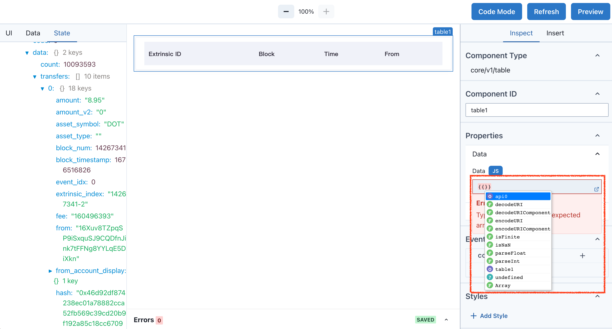

# Expression

在 Widget Editor 中使用 Javascript

---

因为 JavaScript 是在 Subscan Widget 中构建的不可或缺的一部分，所以我们将讨论特殊的 JavaScript 概念。如果你是 JavaScript 或者编程的新手，有一些外部资源可以帮助你入门。

- [codecademy](https://www.codecademy.com/learn/introduction-to-javascript)

如果你已经熟悉 Javascript 基础知识，大部分 Javascript 知识和 Widget Editor 中是重叠的，可以直接跳过这一部分，直接学习 Widget Editor 中的 Javascript。

Editor 通过拖拽按钮，表格，标签页等展示你的数据。在具体数据转换编辑时，需要使用 Javascript。

## 数据类型

JavaScript 中的一切都是对象，这意味着它有一些内置方法和属性。

> 在 Widget Editor 中，Object 仅仅指类似于 `{name: 'alice', age: 18}` 的数据为 Object。 比 Javascript 范围更加的小。

JavaScript 有以下几种常见的数据类型，在 Widget Editor 中都是有效的。

| 类型    | 描述                                                               | 用例                          |
| ------- | ------------------------------------------------------------------ | ----------------------------- |
| String  | 一个用引号括起来的值。如果一个数字被引号括起来，它就是一个字符串。 | `"hi", "1", "true", "Object"` |
| Number  | 一个数字值。数字也不用引号括起来。                                 | `5, 6, -100`                  |
| Boolean | 真值或假值。 `true` 和 `false` 是不需要用引号引起来的保留关键字。  | `true, false`                 |
| Array   | 一种类似列表的有序数据结构，可以存储由硬括号包围的多种数据类型。   | `[1, [1, "hi"], 'hi']`        |
| Object  | 一种无序的数据结构，其键值对由花括号括起来并由逗号分隔。           | `{name: 'alice', age: 18}`    |

## 数据转换

| 方法                     | 描述                            | 用例                                | 结果        |
| ------------------------ | ------------------------------- | ----------------------------------- | ----------- |
| `parseInt("")`           | 字符串 → 整型数值               | `{{ parseInt("3") }}`               | `3`         |
| `number.toString()`      | 数值 (整型, 浮点型 等) → 字符串 | {{ 3.toString() }}                  | `"3.5"`     |
| ['3.5', '3'].map(Number) | 字符串数组 → 数值数组           | `{{ ['3.5', '3', 8].map(Number) }}` | `[3.5,3,8]` |

## 判断真假

[Truthy-Falsy](https://www.sitepoint.com/javascript-truthy-falsy/)

## 操作符

JavaScript 操作符是用于执行各种算术、比较和逻辑操作的符号或关键词。
通过使用这些操作符，JavaScript 开发人员可以执行各种任务，如计算数字、合并字符串、比较值、控制流程以及执行更高级的编程功能，如条件语句、循环和函数。

| 操作符号 | 描述     | 例子                          |
| -------- | -------- | ----------------------------- |
| `+`      | 加法     | `2 + 2` 等于 `4`              |
| `-`      | 减法     | `5 - 3` 等于 `2`              |
| `*`      | 乘法     | `2 * 3` 等于 `6`              |
| `/`      | 除法     | `10 / 2` 等于 `5`             |
| `%`      | 取余     | `10 % 3` 等于 `1`             |
| `=`      | 赋值     | `x = 5` 将 `5` 赋值给 `x`     |
| `==`     | 等于     | `5 == "5"` 返回 `true`        |
| `===`    | 全等     | `5 === "5"` 返回 `false`      |
| `!=`     | 不等于   | `5 != "5"` 返回 `false`       |
| `>`      | 大于     | `10 > 5` 返回 `true`          |
| `<`      | 小于     | `5 < 2` 返回 `false`          |
| `>=`     | 大于等于 | `10 >= 10` 返回 `true`        |
| `<=`     | 小于等于 | `3 <= 1` 返回 `false`         |
| `&&`     | 逻辑与   | `true && false` 返回 `false`  |
| `\|\|`   | 逻辑或   | `true \|\| false` 返回 `true` |
| `!`      | 逻辑非   | `!true` 返回 `false`          |
| `++`     | 自增     | `x++` 将 `x` 的值增加 `1`     |
| `--`     | 自减     | `y--` 将 `y` 的值减少 `1`     |

## 全局方法和状态

在支持表达式的输入框输入 `{{}}`，启动表达式功能。Editor 提供自动补全的选项，如果你输入一个 Object 的名称 (里面有 `name` 属性)，在你输入 `.` 时，会出现下拉框，提示可使用的选项。

