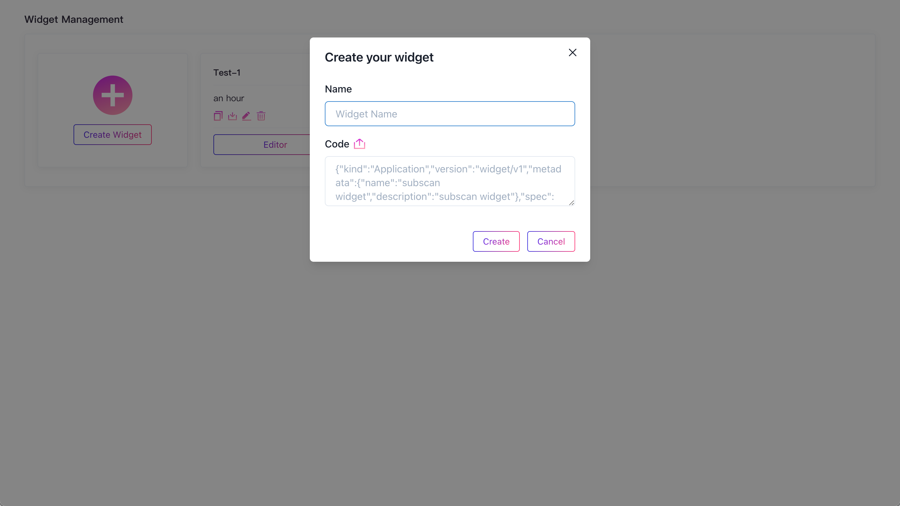

# Widget 管理

管理已创建的 Widget 和新建 Widget, 还可以对 Widget 下载、上传 JSON。

---

## 创建 Widget

你可以通过 `Create Widget` 表单创建新的 Widget， 表单中 Name 字段是 Widget 的昵称，Code 右侧上传按钮作用是通过备份的 Widget JSON 文件来初始化一个 Widget。

### 编辑 Widget

跳转到 Editor 界面，编辑 Widget。Widget Editor 界面会在后面章节做详细的介绍。
