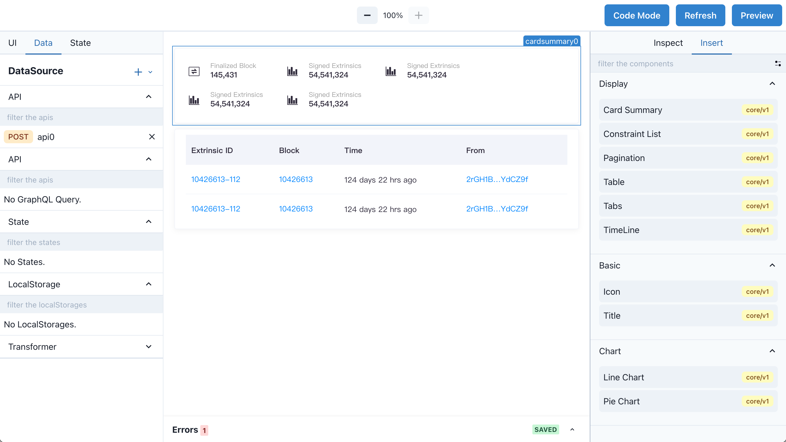
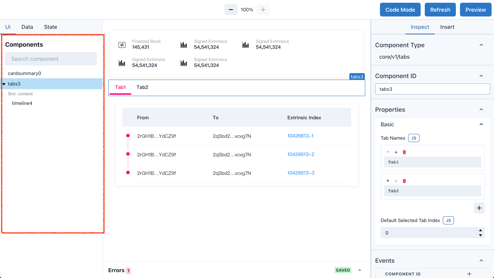
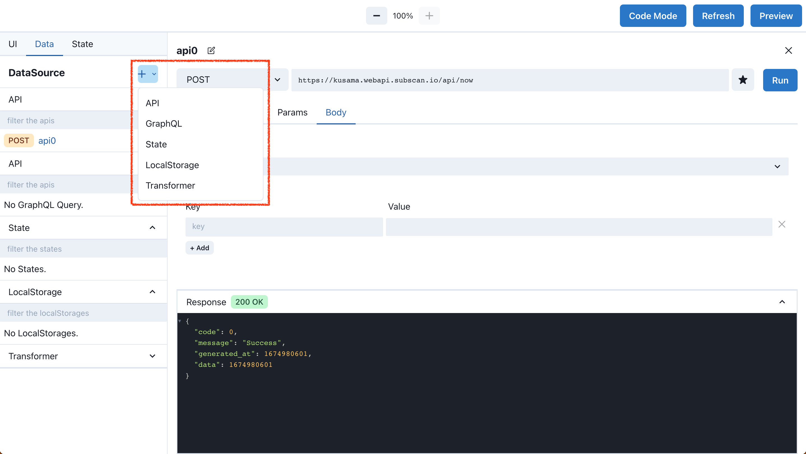
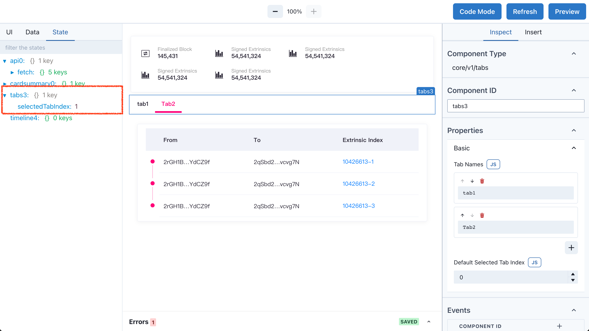
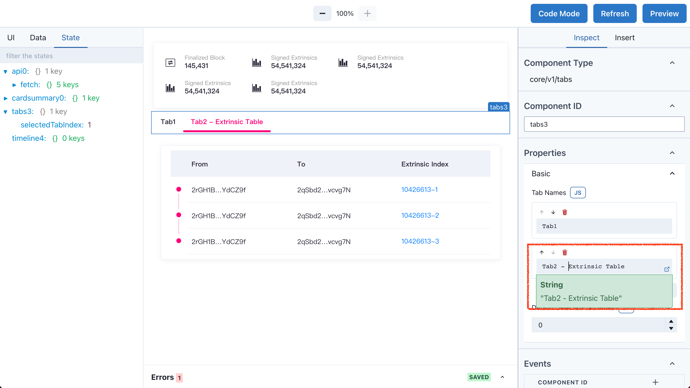
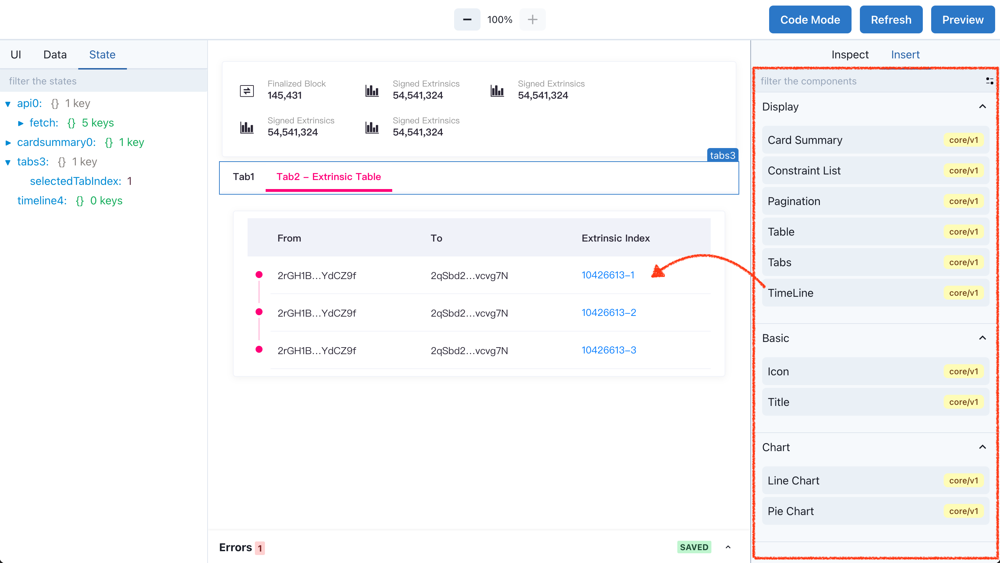

# Widget Editor

Widget Editor 是用户构建Widget的界面，它由五个模块组成：

- 中间面板 (Canvas) - 摆放组件来构建你的 Widget
- 左侧面板 - 组件浏览器, api, 全局状态
- 右侧面板 - 组件仓库，配置组件参数
- 顶部面板 - 设置 Widget 参数
- 底部面板 - 日志控制台

## 中间面板 (Canvas)

Canvas 区域是构建 Widget 主要区域，你可以从 右侧面板 - Insert tab 里拖拽组件到 Canvas，组件是响应式的布局，会自动适配屏幕大小。

### 布局组件

拖放组件到 Canvas 画板中. 新加入在 Canvas 的组件会自动摆放页面的最下面，已经摆放在 Canvas 的组件没法在 Canvas 中进行拖拽排序，如果需要调整组件排序，可以在左侧面板 - UI中进行排序。

> 在 Canvas 中选中一个组件，按 `delete` 可以快速的删除它

## 左侧面板

左侧面板包含 UI，Data 和 State tab, 为 Widget 提供一个可视化的组件树状结构。

### UI tab

UI tab 允许你对组件进行查看和交互，组件树状结构可以更清晰的查看 Widget 的全部组件，你能拖动组件进行排序，或者删除它们。

一些组件是类似于一个容器，比如 Tabs，Tab 的 Content 是一个 Slot （插槽），我们可以把其他组件拖放在 Tabs Slot 内，作为 Tabs 的子组件，来实现更复杂的交互。

### Data tab

Data tab 管理 Widget 所有的数据源，包括API, GraphQL, State, LocalStorage, Transformer。你可以添加其中的任意一种或者多种的数据源，下图中添加了一个API数据源，在列表中可以看出，`api0` 是一个 `POST` 请求，选中 `api0` ，可以查看和编辑这个 API 请求，修改URL，Params，Body 等等。在成功配置完api0后，可以通过 `{{api0.fetch.data}}`, `{{api0.fetch.loading}}` 获取api0的返回结果。表达式的用法将会在后面的教程中详细讲解。

### State tab

State tab 展示当前 Widget 内组件, api 等所有模块的状态，包含例如 api 的返回值 或者组件的设置。state 相当于编程中的全局变量。Widget 内部的component和dataSource，都可以访问 State 值。例如, `{{ tabs3.selectedTabIndex }}` 获取 `tabs3` 组件 index 属性，返回值是 Number，tab 选中的是 tab2，所以 index 是 1（从0开始）。

## 右侧面板

右侧面板包含 Inspect 和 Insert tabs. 组件和编辑组件配置都在这个面板.

### Inspect tab

在构建 widget 过程中，Inspect tab 是交互最多的 panel ，首先在 Canvas 中选择需要配置的 component, Inspect 会展示选中 component 的所有 settings （Component Type, Components ID, Properites, Events ...)，在 Inspect 中修改设置，Canvas 会实时渲染新的设置。

例子中，我们在 Properies 中，对 Tab Names 做个小修改，将Tab2 改为 Tab2 - Extrinsic Table，Canvas 中 Tab 的名称也同时发生了改变。

### Insert tab

Insert tab 是一个包含所有的 components 的仓库，将 component 从这个tab拖放到 Canvas 来为 Widget 新增一个 component。每个 Component 包含 `core/v1` 的标识，`core` 表示类型， `v1` 表示版本，随着 Widget Editor 的持续开发，Component 也会逐渐变多，同一个组件也会存在不同的版本，你能通过顶部的搜索框快速找到想要的组件。

