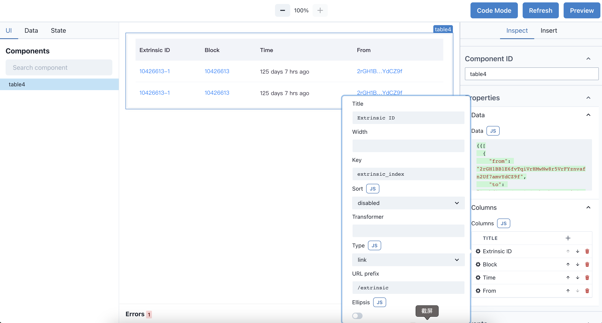
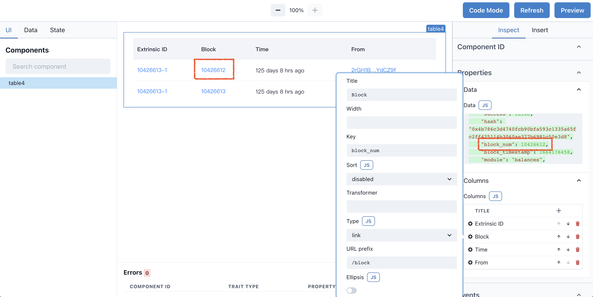
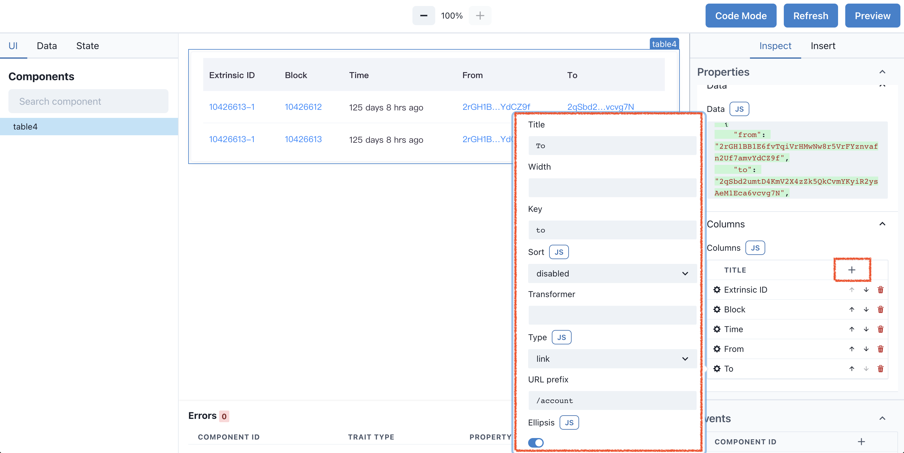

# Table 组件

使用 Table 组件展示你的数据

---

Table 是展示数据最基础的组件，可以对数据进行自定义列的展示，排序，特定类型的渲染，甚至配合 Pagination 组件完成翻页功能。

## 实现 Extrinsic Table

尝试实现一个展示 Extrinsic 条目的 Table， Table 包含不同类型的列，其中 Extrinsic ID, Block， From, To 栏目是可以跳转的超链接。



## 初始化数据源

当拖拽一个 Table 组件到 Canvas 后，它会自动的展示一些数据，这些数据是内置的测试数据，可以随时修改。 Properties - Data 栏目是 Table 的数据源，初始化数据是一个数组： `{{ [{Extrinsic Object}, {Extrinsic Object}] }}`，不难看出，这是固定的数据，在实际的使用过程中，多数会从 API 接口获取数据，再通过 `{{ api.fetch.data }}` 读取，在 Expression 章节有详细说明。

我们尝试将数组 index = 0 的内容做些小修改（"block_num": 10426613 修改为 10426612），观察 Table 的变化。



## 新增栏目

在新增 Table 组件时， 默认的栏目有 4 个，我们尝试在最后新增 To 栏目，用于展示 Transfer reciver。首先在 Canvas panel 选中 Table 组件，使其高亮。切换 Right panel 到 Inspect tab，点击 Columns + Icon，新增一个栏目。

Title 表示 新增 Table 栏目的标题，Key 表示数据源的 Object Key，数据源是下面的 JSON, 填写 `to`，Editor 会自动将此列数据来源与 `Data.to` 做绑定。
我们期望 To 被渲染为一个链接，点击跳转到 To 的账户页面，所以在 Type 内选择了 Link。URL prefix 则表示跳转的 URL 前缀，完整的 URL 生成规则时 `${URL prefix}/${column value}`，所以例子中完整的地址是`/account/账户地址`。

``` json
[
  {
    "from": "2rGH1BB1E6fvTqiVrHMwNw8r5VrFYznvafn2Uf7amvYdCZ9f",
    "to": "2qSbd2umtD4KmV2X4zZk5QkCvmYKyiR2ysAeM1Eca6vcvg7N",
    "extrinsic_index": "10426613-1",
    "success": false,
    "hash": "0x4b786c3d4740fcb90bfa593c1335a65fc2ff425114b3060ae377b6981c50e3d8",
    "block_num": 10426612,
    "block_timestamp": 1664176458,
    "module": "balances",
    "amount": "86.13245",
    "amount_v2": "86132450000",
    "fee": "114600000",
    "nonce": 7,
    "asset_symbol": "",
    "asset_type": "",
    "from_account_display": {
      "address": "2rGH1BB1E6fvTqiVrHMwNw8r5VrFYznvafn2Uf7amvYdCZ9f"
    }
  }
]
```



| Column Key  | Description                                                                        | Example                                                         |
| ----------- | ---------------------------------------------------------------------------------- | --------------------------------------------------------------- |
| Title       | 表头的标题                                                                         |                                                                 |
| Width       | Column 宽度，不设置默认自动                                                        |                                                                 |
| Key         | 数据来源的 Key                                                                     |                                                                 |
| Sort        | 数据排序                                                                           | `disabled` `default` `asc` `desc`                               |
| Transformer | 数据处理器，对原始数据做自定义的包装                                               | `'ID is ' + $value + ' ~'`                                      |
| Type        | 内置的渲染类型，例如：time，方便的将时间戳数据解析为用户方便阅读的 YYYY-MM-DD 格式 | `text` `link` `transactionStatus` `balance` `time` `tag` `code` |

> 选择不同的 Type，会有不同的子选项，例如： Balance 子选项有，Token Decimals 用于设置 Token 精度， Token Symbol 用于在数值后表明标明是 Token 名称

## 代码

``` json
{
  "version": "widget/v1",
  "kind": "Application",
  "metadata": {
    "name": "subscan widget"
  },
  "spec": {
    "components": [
      {
        "id": "title4",
        "type": "core/v1/title",
        "properties": {
          "text": "Subscan Title"
        },
        "traits": []
      },
      {
        "id": "icon3",
        "type": "core/v1/icon",
        "properties": {
          "name": "barchart",
          "spin": false
        },
        "traits": [
          {
            "type": "core/v1/slot",
            "properties": {
              "container": {
                "id": "title4",
                "slot": "prefix"
              },
              "ifCondition": true
            }
          }
        ]
      },
      {
        "id": "table5",
        "type": "core/v1/table",
        "properties": {
          "data": "{{[\n  {\n    \"from\": \"2rGH1BB1E6fvTqiVrHMwNw8r5VrFYznvafn2Uf7amvYdCZ9f\",\n    \"to\": \"2qSbd2umtD4KmV2X4zZk5QkCvmYKyiR2ysAeM1Eca6vcvg7N\",\n    \"extrinsic_index\": \"10426613-1\",\n    \"success\": false,\n    \"hash\": \"0x4b786c3d4740fcb90bfa593c1335a65fc2ff425114b3060ae377b6981c50e3d8\",\n    \"block_num\": 10426612,\n    \"block_timestamp\": 1664176458,\n    \"module\": \"balances\",\n    \"amount\": \"86.13245\",\n    \"amount_v2\": \"86132450000\",\n    \"fee\": \"114600000\",\n    \"nonce\": 7,\n    \"asset_symbol\": \"\",\n    \"asset_type\": \"\",\n    \"from_account_display\": {\n      \"address\": \"2rGH1BB1E6fvTqiVrHMwNw8r5VrFYznvafn2Uf7amvYdCZ9f\"\n    },\n    \"to_account_display\": {\n      \"address\": \"2qSbd2umtD4KmV2X4zZk5QkCvmYKyiR2ysAeM1Eca6vcvg7N\",\n      \"display\": \"0x245b4775082c144c22a4874b0fba8c70c510c5ae\"\n    },\n    \"event_idx\": 1\n  },\n  {\n    \"from\": \"2rGH1BB1E6fvTqiVrHMwNw8r5VrFYznvafn2Uf7amvYdCZ9f\",\n    \"to\": \"2qSbd2umtD4KmV2X4zZk5QkCvmYKyiR2ysAeM1Eca6vcvg7N\",\n    \"extrinsic_index\": \"10426613-1\",\n    \"success\": false,\n    \"hash\": \"0x4b786c3d4740fcb90bfa593c1335a65fc2ff425114b3060ae377b6981c50e3d8\",\n    \"block_num\": 10426613,\n    \"block_timestamp\": 1664176458,\n    \"module\": \"balances\",\n    \"amount\": \"86.13245\",\n    \"amount_v2\": \"86132450000\",\n    \"fee\": \"114600000\",\n    \"nonce\": 7,\n    \"asset_symbol\": \"\",\n    \"asset_type\": \"\",\n    \"from_account_display\": {\n      \"address\": \"2rGH1BB1E6fvTqiVrHMwNw8r5VrFYznvafn2Uf7amvYdCZ9f\"\n    },\n    \"to_account_display\": {\n      \"address\": \"2qSbd2umtD4KmV2X4zZk5QkCvmYKyiR2ysAeM1Eca6vcvg7N\",\n      \"display\": \"0x245b4775082c144c22a4874b0fba8c70c510c5ae\"\n    },\n    \"event_idx\": 1\n  }\n]}}",
          "columns": [
            {
              "title": "Extrinsic ID",
              "type": "link",
              "width": "",
              "dataKey": "extrinsic_index",
              "prePath": "/extrinsic",
              "ellipsis": false,
              "sort": "disabled",
              "transformer": "'ID is ' + $value + ' ~'",
              "decimals": -9007199254740991
            },
            {
              "title": "Block",
              "type": "link",
              "width": "",
              "dataKey": "block_num",
              "prePath": "/block",
              "ellipsis": false,
              "sort": "disabled",
              "transformer": ""
            },
            {
              "title": "Time",
              "type": "time",
              "width": "",
              "dataKey": "block_timestamp",
              "sort": "disabled",
              "transformer": ""
            },
            {
              "title": "From",
              "type": "link",
              "width": "",
              "dataKey": "from",
              "prePath": "/account",
              "sort": "disabled",
              "transformer": ""
            },
            {
              "title": "To",
              "width": "",
              "dataKey": "to",
              "sort": "disabled",
              "transformer": "",
              "type": "link",
              "prePath": "/account",
              "ellipsis": true,
              "decimals": 0,
              "tagstyle": "primary",
              "symbol": ""
            }
          ]
        },
        "traits": []
      }
    ]
  }
}
```
