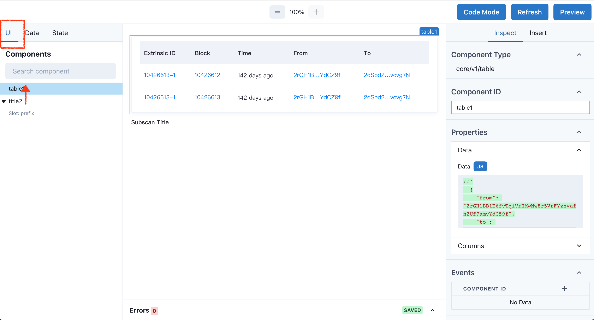
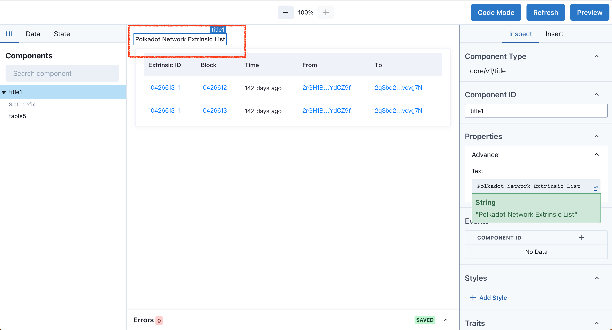

# Title 组件

使用 Title 组件展示一段文案

---

Title 是一个非常基础的小组件，可以使用 Title 显示文章标题，表格标题，或者一段任意的文字。

## 实现表格的标题

首先可以在 Table 讲解中可以学会制作一个表格，现在我们需要为表格添加一个标题，让阅读者直观的了解表格的主题。

## 调整组件顺序

从 Insert Tab 的组件库内找到 Title 组件，拖拽到 Canvas 中，Title 组件默认添加在页面的最下方，作为表格标题，我们期望它在表格的上方。你可以在左侧面板 UI Tab 内拖拽 `title2`，移动到 `table1` 上方，Canvas 对应的组件也会实时进行排序。

## 标题

选中 Title 组件并切换到 Inspect Tab，Inspect Tab 显示的是组件可以编辑的属性。 Text 属性是 Title 显示的内容，修改为你想展示的内容。为了配合例子，我们修改为: `Polkadot Network Extrinsic List`。

