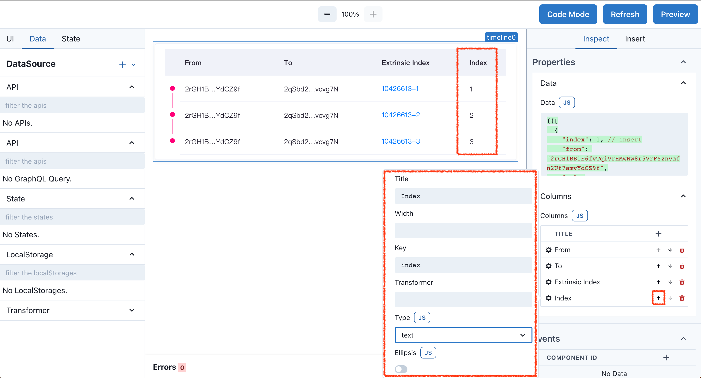
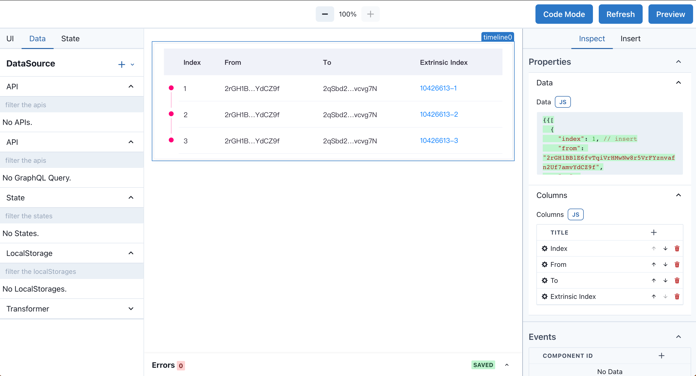

# TimeLine 组件

可视化地呈现时间流信息。

---

## 制作一个带有 Index 的交易时间线

默认的测试数据没有 Index 属性，我们为测试数据新增一列，值从 1 到 3。

``` javascript
{{[
  {
    "index": 1, // insert
    "from": "2rGH1BB1E6fvTqiVrHMwNw8r5VrFYznvafn2Uf7amvYdCZ9f",
    "to": "2qSbd2umtD4KmV2X4zZk5QkCvmYKyiR2ysAeM1Eca6vcvg7N",
    "extrinsic_index": "10426613-1"
  },
  {
    "index": 2, // insert
    "from": "2rGH1BB1E6fvTqiVrHMwNw8r5VrFYznvafn2Uf7amvYdCZ9f",
    "to": "2qSbd2umtD4KmV2X4zZk5QkCvmYKyiR2ysAeM1Eca6vcvg7N",
    "extrinsic_index": "10426613-2"
  },
  {
    "index": 3, // insert
    "from": "2rGH1BB1E6fvTqiVrHMwNw8r5VrFYznvafn2Uf7amvYdCZ9f",
    "to": "2qSbd2umtD4KmV2X4zZk5QkCvmYKyiR2ysAeM1Eca6vcvg7N",
    "extrinsic_index": "10426613-3"
  }
]}}
```

你也可以直接将上述数据直接粘贴到 TimeLine 组件的 Data 框内。

和 Table 组件一样，TimeLine 组件也有 Columns 属性，方便的添加列，点击 + 号，在 Column 弹窗中设置列详情，Title: Index，Key 是绑定数据源的Object key，在本例中是第一步骤为测试数据新增的key `index`。Type 选择 `text`，表示文本组件。通过上述操作，TimeLine 已经显示出 Index 列。

最后一步，调整列的顺序，在 Columns 菜单的右侧，分别有`向上箭头`，`向下箭头`，`垃圾桶`图标。通过点击`向上箭头`，移动 Index 列到第一位。



效果图：


