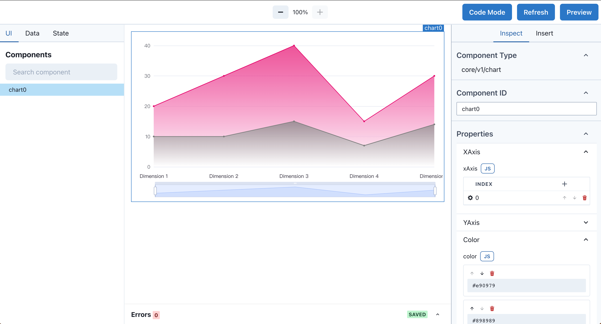
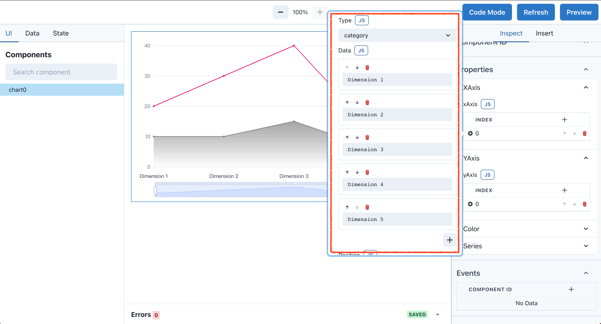
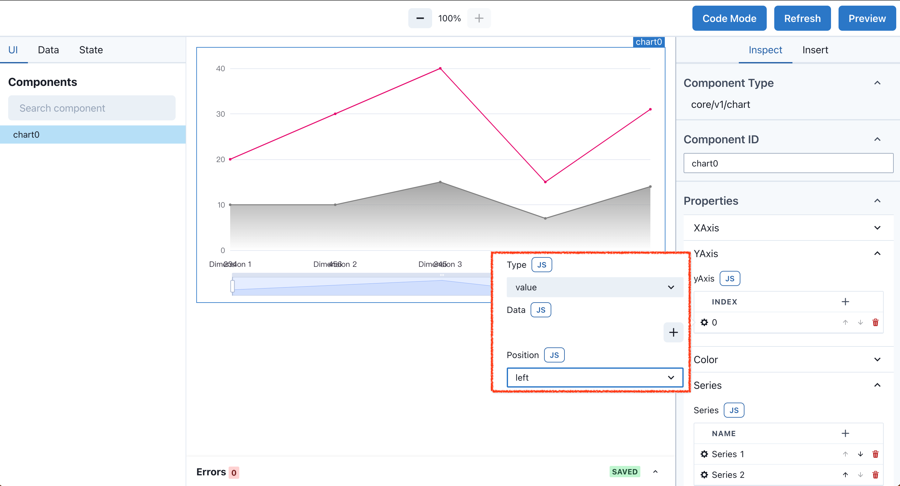
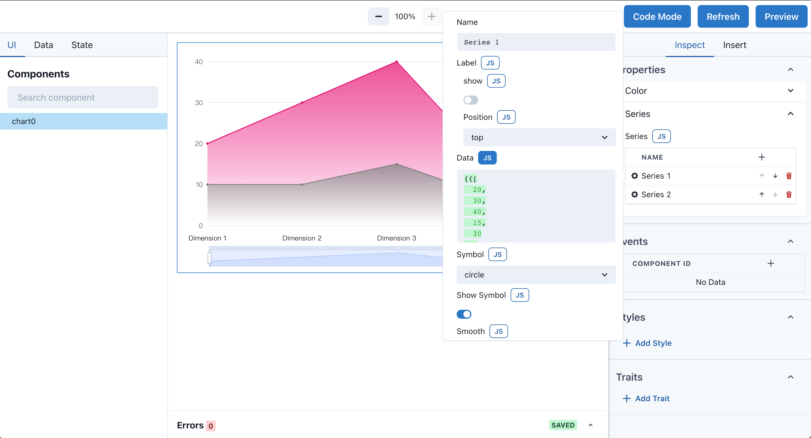

# Line Chart 组件

用图表生动的展示你的数据。

---

Chart 系列组件可以以可视化的方式展示数据，底层基于 [Echarts](https://echarts.apache.org/) ，所以在 Echarts 官网可以发现更多的使用说明以及参数文档。

## 例子

---

## XAxis

直角坐标系 grid 中的 x 轴，一般情况下单个 grid 组件最多只能放上下两个 x 轴，多于两个 x 轴在同个位置会造成重叠。

### Type

坐标轴类型。

可选：

- 'value' 数值轴，适用于连续数据。
- 'category' 类目轴，适用于离散的类目数据。为该类型时类目数据可自动从 series.data 中取，或者可通过 xAxis.data 设置类目数据。

### Data

类目数据，在类目轴（type: 'category'）中有效。

### Position

x 轴的位置。可选：`'top'` `'bottom'`

默认 grid 中的第一个 x 轴在 grid 的下方（'bottom'），第二个 x 轴视第一个 x 轴的位置放在另一侧。

---

## YAxis

直角坐标系 grid 中的 y 轴，一般情况下单个 grid 组件最多只能放上下两个 y 轴，多于两个 y 轴在同个位置会造成重叠。

### Type

坐标轴类型。
可选：

- 'value' 数值轴，适用于连续数据。
- 'category' 类目轴，适用于离散的类目数据。为该类型时类目数据可自动从 series.data 中取，或者可通过 yAxis.data 设置类目数据。

### Data

类目数据，在类目轴（type: 'category'）中有效。

### Position

x 轴的位置。可选：`'left'` `'right'`

默认 grid 中的第一个 y 轴在 grid 的左侧（'left'），第二个 y 轴视第一个 y 轴的位置放在另一侧。

---

## Color

调色盘颜色列表。如果系列没有设置颜色，则会依次循环从该列表中取颜色作为系列颜色。 默认为网络主题色。

支持的颜色格式：

- 使用 RGB 表示颜色，比如 'rgb(128, 128, 128)'，如果想要加上 alpha 通道表示不透明度，可以使用 RGBA，比如 'rgba(128, 128, 128, 0.5)'，也可以使用十六进制格式，比如 '#ccc'。

---

## Series

### Name

系列名称

### Label

图形上的文本标签，可用于说明图形的一些数据信息，比如值，名称等。

**show** - 是否显示标签。
**position** - 标签的位置。支持：top / left / right / bottom / inside / insideLeft / insideRight / insideTop / insideBottom / insideTopLeft / insideBottomLeft / insideTopRight / insideBottomRight

### Data

图表的数据源设置在 Properties - Series - Data 内，默认以列表的形式填写数据。如果数据源来自 API，点击 Data 标题右侧的 `js` 按钮，转换为表达式模式，通过类似 `{{api0.fetch.data}}` 动态加载数据。

### Symbol

标记的图形。提供的标记类型包括 `'circle'`, `'rect'`, `'roundRect'`, `'triangle'`, `'diamond'`, `'pin'`, `'arrow'`, `'none'`

### Show Symbol

是否显示 symbol, 如果 false 则只有在 tooltip hover 的时候显示。

### Smooth

是否平滑曲线显示，表示是否开启平滑处理。

### Active Area Style

区域填充样式。设置后显示成区域面积图。

---
