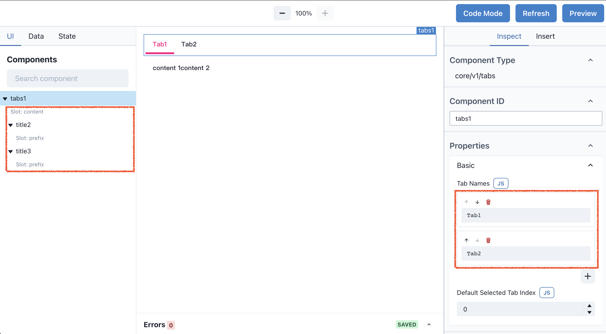
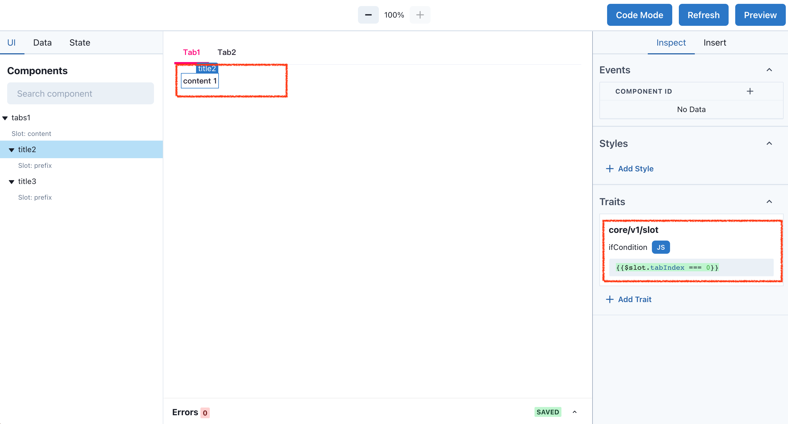

# Tabs 组件

分隔内容上有关联但属于不同类别的数据集合。

---

## 制作一个基础的、简洁的标签页

Tabs 组件可以很好的管理不同类别的数据，切换不同 Tab，展示不同的数据内容。

添加 Tabs 组件，在左侧面板不难发现，Tabs 组件和 Title 组件一样，包含 `Slot` 槽位，可以将其他组件拖拽到槽位里，成为 Tabs 的子组件。新增 2 个 Title 组件，内容分别是 `content 1`, `content 2`，并将他们拖拽到 Tabs 组件的插槽内。



控制 `content 1`, `content 2` 显示与隐藏，需要用到一个新的特性 `Trait`。选中 `content 1`，Inspect 下找到 Traits，默认会看到 `core/v1/slot` train，`ifCondition` 值为 `true`，表示显示自身组件，值为 `false` 表示隐藏自身组件。

> Trait 本质上是一个函数。Trait 的作用是为了增加 Component 的能力。如果还是用面向对象来打比方，Trait 是 Component 的装饰器。比如说，给 Component 添加样式、添加状态等等。

Tabs 组件对所有的子组件传递当前激活的 Tab Index，例如当前选中 `Tab1`，Tabs 向子组件传递 `$slot.tabIndex` 为 `0` 的值，选中 `Tab2`，则向子组件传递 `$slot.tabIndex` 为 `1` 的值。你可以在 `ifCondition` 内使用表达式，判断 `$slot.tabIndex` 值，控制显示隐藏。 `content 1` 中 `ifCondition` 设置 `{{$slot.tabIndex === 0}}`，表示如果父组件传递的值仅为 `0` 时，显示自身。`content 1` 中 `ifCondition` 设置 `{{$slot.tabIndex === 1}}`，现在切换 tab 试试效果。



## 代码

``` json
{
  "version": "widget/v1",
  "kind": "Application",
  "metadata": {
    "name": "subscan widget"
  },
  "spec": {
    "components": [
      {
        "id": "tabs1",
        "type": "core/v1/tabs",
        "properties": {
          "tabNames": [
            "Tab1",
            "Tab2"
          ],
          "initialSelectedTabIndex": 0
        },
        "traits": []
      },
      {
        "id": "title2",
        "type": "core/v1/title",
        "properties": {
          "text": "content 1"
        },
        "traits": [
          {
            "type": "core/v1/slot",
            "properties": {
              "container": {
                "id": "tabs1",
                "slot": "content"
              },
              "ifCondition": "{{$slot.tabIndex === 0}}"
            }
          }
        ]
      },
      {
        "id": "title3",
        "type": "core/v1/title",
        "properties": {
          "text": "content 2"
        },
        "traits": [
          {
            "type": "core/v1/slot",
            "properties": {
              "container": {
                "id": "tabs1",
                "slot": "content"
              },
              "ifCondition": "{{$slot.tabIndex === 1}}"
            }
          }
        ]
      }
    ]
  }
}
```
